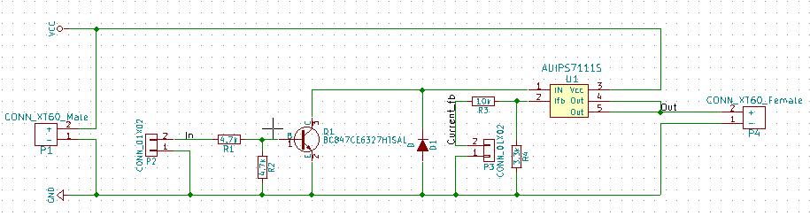

# AUIPS7111S

> The [AUIPS7111S](http://www.farnell.com/datasheets/1441780.pdf) is a fully protected four terminal high
> side switch. It features current sensing, over-current, over-
> temperature, ESD protection and drain to source active
> clamp. When the input voltage Vcc - Vin is higher than the
> specified threshold, the output power Mosfet is turned on.
> When the Vcc - Vin is lower than the specified Vil
> threshold, the output Mosfet
> is turned off. The Ifb pin is
> used for current sensing.

## AUIPS7111S Test curcuit

This is a prototype sub part of PDB.

The voltage across R4 is `V_R4 = R_4 * I_fb`. So we can configurate the R4 to set the current sense voltage propotional constant to current draw.

`V_R4 = R_4 * I_VCC_Out / Ratio`

### Parts

| Part  | Function  |
|-----|---|
| P1  | Power input |
| P4  | Power output  |
| R1  | Current limiter for BJT. Prevent destroying the BJT or waste power.  |
| R2  | Passive pull down for BJT. We want to make sure the U1 is passively off in case of signal `In` is high impedance.  |
| D1  | Protection for BJT in case of reverse current.  |
| U1  | Switch, current sensing.  |
| R4  | Voltage gain for current sensing. Resistance from `I_fb` to `GND` is max 1.5k [datasheet](http://www.farnell.com/datasheets/1441780.pdf)  |
| R3  | Protection for U1. Resistance from `I_fb` to `GND` is max 1.5k [datasheet](http://www.farnell.com/datasheets/1441780.pdf)  |
| P2  | Input. Connector to control the U1. |
| P3  | Output. Current feedback. |

### Truth table
| `P2_In`  | `U1`  |
|---|---|
| High | On |
| Low | Off |
| High impedance | Off |
